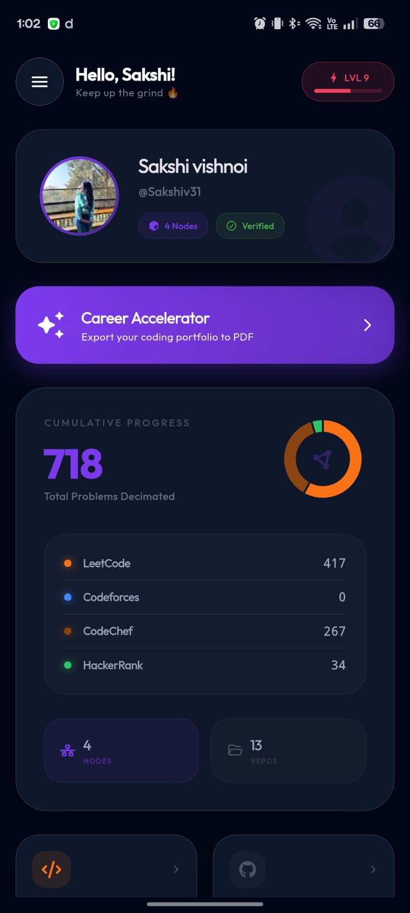
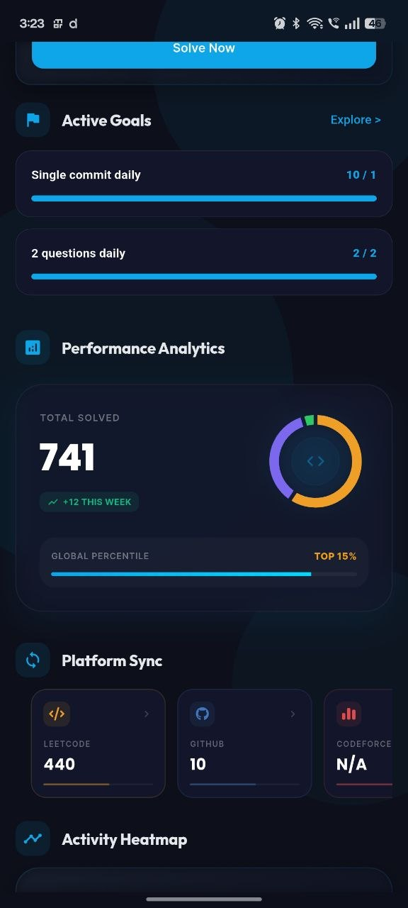
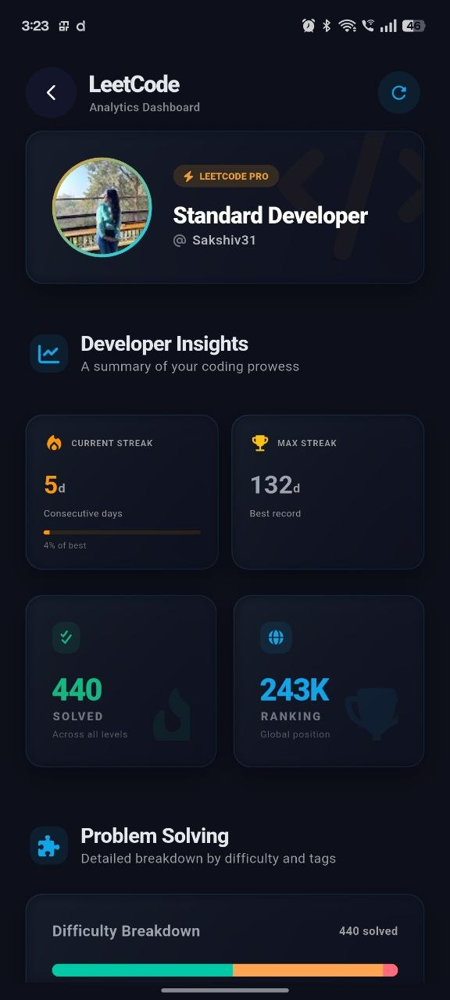
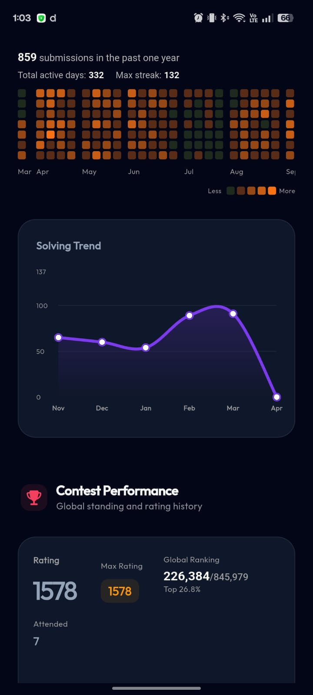
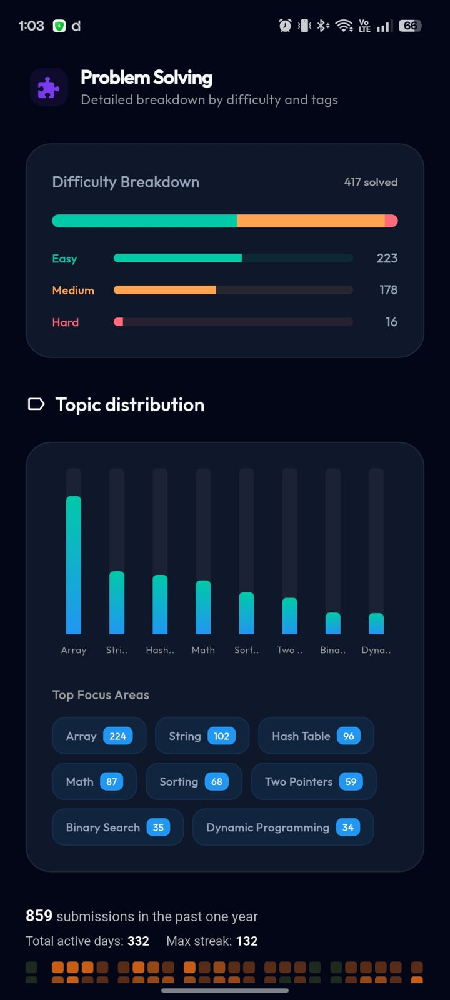
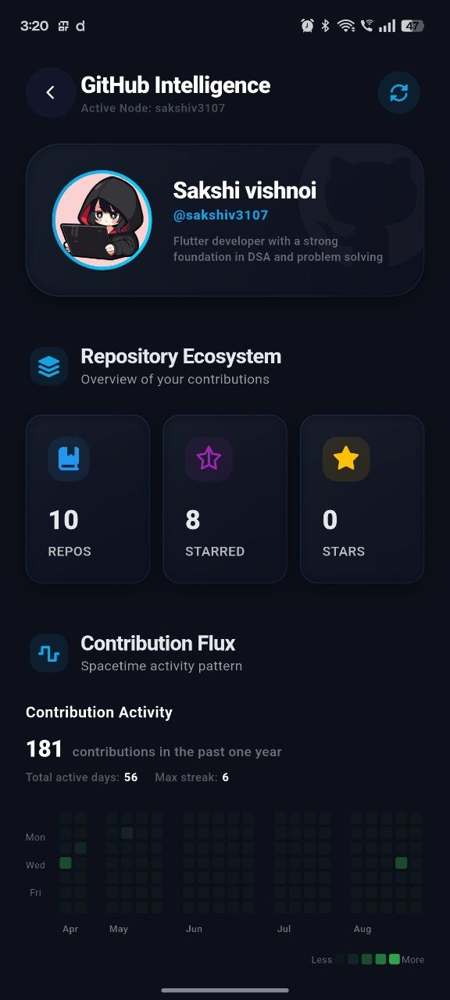
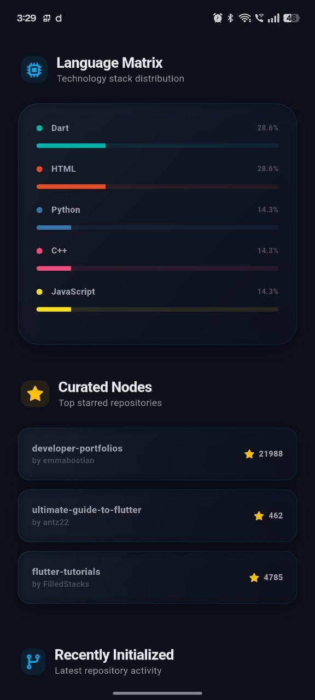
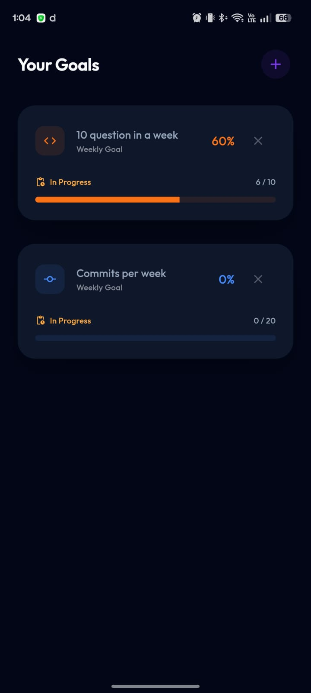
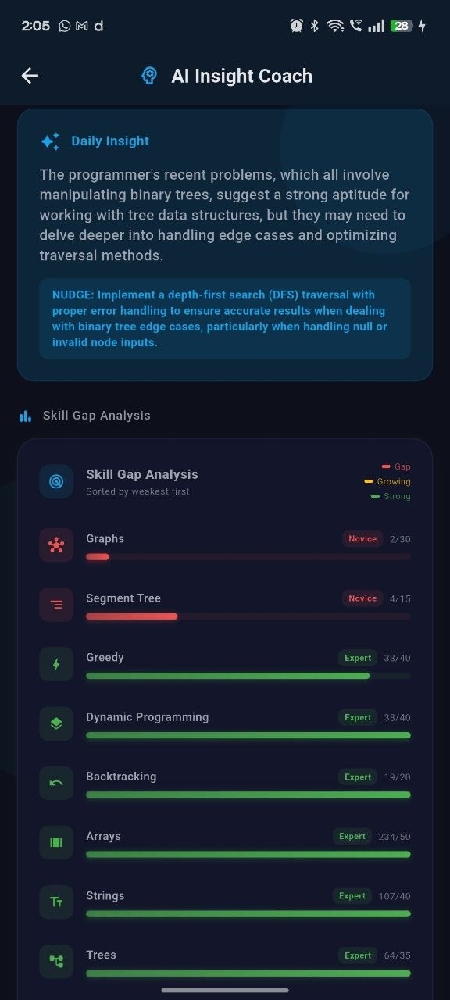
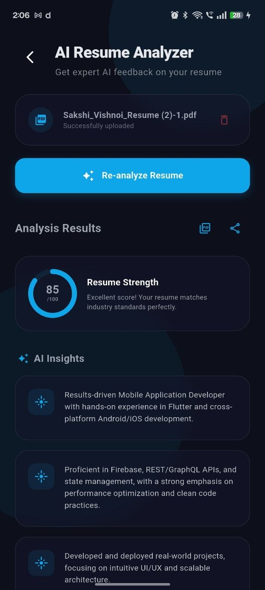

# 🌌 CODESPHERE

  🚀 <b>Your Smart Coding Analytics Companion</b>  
  Track · Analyze · Improve · Dominate

---

  
  
  
  
  
  

---

> 📌 **Note:** Enable *Install from Unknown Sources* in Android settings before installing the APK.

---

# 📚 Table of Contents

* [✨ Overview](#-overview)
* [⚡ Features](#-features)
* [📸 Screenshots](#-screenshots)
* [🛠 Tech Stack](#-tech-stack)
* [📬 Contact](#-contact)

---

# ✨ Overview

**CodeSphere** is a beautifully crafted, multi-platform coding analytics app built for competitive programmers and developers who want a unified view of their journey across platforms. Say goodbye to switching between LeetCode, CodeChef, GeeksforGeeks, and GitHub tabs — CodeSphere brings all your stats, streaks, contest history, and recent submissions into one sleek dark dashboard.

It brings together insights from platforms like **LeetCode, CodeChef, Codeforces, and GitHub** into a single powerful dashboard.

Whether you're:

* 🎯 Preparing for placements
* 🧠 Practicing DSA daily
* 🏆 Competing in contests

CodeSphere helps you stay on track with **data-driven insights and smart recommendations**.

---

# ⚡ Features

* **📊 Unified Coding Dashboard**: Aggregate your stats from LeetCode, CodeChef, GeeksforGeeks, and GitHub — all in a single, beautiful home screen with animated cards and platform-wise breakdowns.
* **🤖 AI Insight Coach**: Powered by **Google Gemini** (via direct REST calls with `gemini-2.0-flash`), get personalized coaching insights, performance analysis, and actionable recommendations based on your real coding activity.
* **🔥 Streak & Activity Tracking**: Visual GitHub-style heatmap showing your daily coding activity. Never lose your streak again.
* **🏆 Contest Analytics**: View your contest ratings, rank history, and performance trends over time across CodeChef and LeetCode.
* **📝 Recent Submissions**: Browse your latest solved problems with verdict, difficulty, and platform info — all in one feed.
* **📄 Resume Analyzer**: Upload your resume and get AI-powered feedback tailored for software engineering roles, with ATS score estimation and improvement suggestions.
* **🔄 OTA Updates**: In-app over-the-air update system via GitHub Releases — the app notifies you and updates itself with one tap.
* **⚡ Smart Caching & Resilience**: Stale-while-revalidate caching, exponential backoff, and parallel multi-source data racing ensure your stats load fast — even on Render.com free-tier cold starts.

---

# 📸 Screenshots

## 🏠 Home Dashboard

  
  

## 💻 LeetCode & Coding Progress

  
  
  

## 🐙 GitHub Insights

  
  

## 🎯 Goals Tracking

  

## 🤖 AI Features

  
  

---

---

## 🛠 Tech Stack

### ⚙️ Core
- Flutter  
- Dart  

### 🔄 State Management
- Provider  

### ☁️ Backend & APIs
- REST APIs  
- Firebase  

### 🎨 UI & Design
- Google Fonts  
- FL Chart  
- Glassmorphism UI  

### 🔧 Utilities
- Shared Preferences  
- Local Notifications  
- URL Launcher  

---

## 📬 Contact

👩‍💻 **Developer:** Sakshi Vishnoi  
📧 **Email:** sakshi.vishnoi3107@gmail.com  

---

# 📬 Contact

👩‍💻 **Developer:** Sakshi Vishnoi
📧 Email: mailto:sakshi.vishnoi3107@gmail.com

---

# ⭐ Support

If you find **CodeSphere** useful, consider giving it a ⭐ on GitHub!

> It motivates development and helps others discover the project 🚀

---
